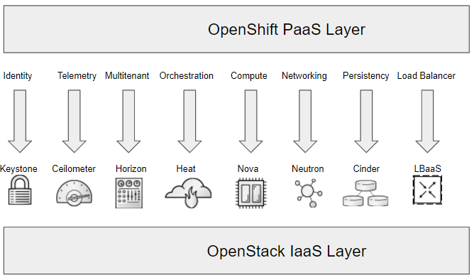

:scrollbar:
:data-uri:
:noaudio:

== Component integration between OpenStack and OpenShift

ifdef::showscript[]

=== Transcript

OpenShift can consume most of the OpenStack services.

endif::showscript[]
