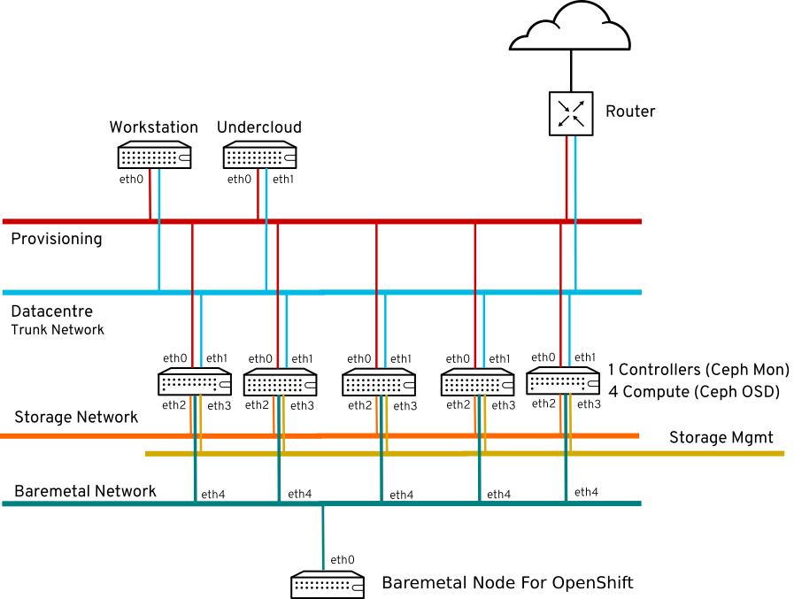

:scrollbar:
:data-uri:
:noaudio:

== OpenStack 13 Environment

ifdef::showscript[]

=== Transcript

The environment used for the labs is cloud-based. There are eight systems in total. Three systems are used as dedicated Neutron network nodes (or networkers), two as compute nodes, one as a controller for all other OpenStack services and API endpoints, and one as a storage server. The eighth system in the environment is used as a jump box. It is the only system that allows SSH connections from outside the environment.

endif::showscript[]
