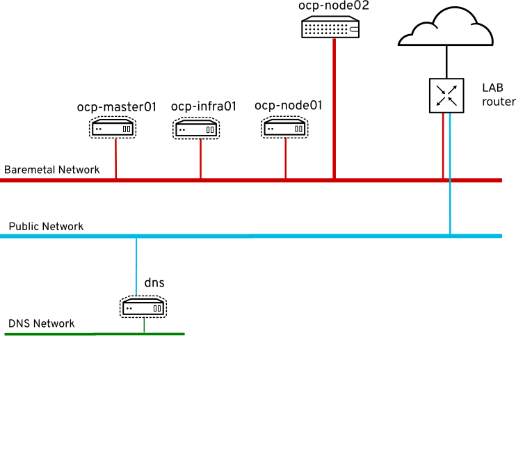

:scrollbar:
:data-uri:
:noaudio:

== OpenShift 3.10 Environment

ifdef::showscript[]

=== Transcript
This environment has a preinstalled OpenShift 3.10, it contains one master, one infra and one compute node. The installation was using openshift-ansible and the VMs were created manually before to run it.

There is one baremetal node (ocp-node02) not installed to be used for the scale up and demonstrate how to use it as a compute node.
The network used for OpenShift is a flat network for all the nodes: virtual and physical ones.

endif::showscript[]
